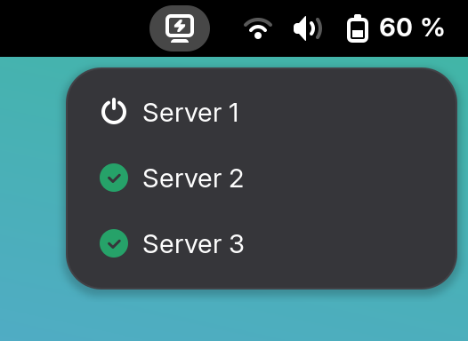

# Gnome Wake-on-LAN Extension

This GNOME Shell extension lets you manage and power on remote servers directly from a GNOME Shell indicator. Each configured server shows its current online status. If a MAC address is provided, you can send a Wake-on-LAN (WOL) packet to power it on remotely.



## Development

The extension is written in JavaScript with JSDoc annotations for a typesafe development experience.

To get started, install the development dependencies:

```bash
npm ci
```

Commit messages follow the [Conventional Commits](https://www.conventionalcommits.org/en/v1.0.0/) standard, and the code style aligns with the GNOME Shell project.

To check code style and correctness:

```bash
npm run lint
```

Git hooks enforce commit message standards and code formatting.

## Translations

To update an existing translation, edit the corresponding file in `src/po`.

To add a new translation, use the template file `src/po/wol@mnorlin.se.pot`.

If the source code has changed and translation files need to be updated:

```bash
npm run update-translations
```

## Packaging the Extension

To package the extension into a zip file for distribution:

```bash
npm run pack
```

The zip file will be saved in the `./build/` directory.

## Testing the Extension

To install the extension locally for testing:

```bash
npm run deploy
```

Then start a nested Wayland session:

```bash
dbus-run-session -- gnome-shell --nested --wayland
```

This runs GNOME Shell in isolation for safe extension testing.
